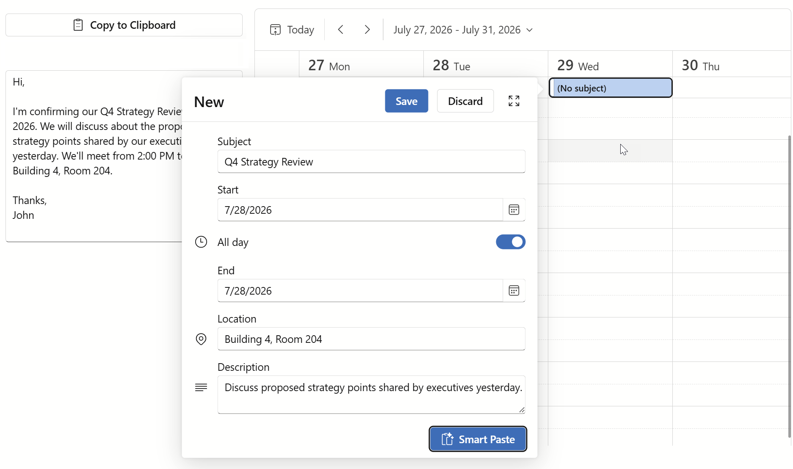

<!-- default badges list -->
Automatically generated badges
<!-- default badges end -->

# Blazor Scheduler — AI-powered Smart Paste

This example adds an [AI-powered Smart Paste extension](https://docs.devexpress.com/Blazor/DevExpress.AIIntegration.Blazor.SmartPasteBase) to the DevExpress Blazor [Scheduler](https://docs.devexpress.com/Blazor/DevExpress.Blazor.DxScheduler) component. Appointment edit forms include Smart Paste buttons designed to simplify data entry when users copy appointment information from external sources. The Smart Paste extension parses clipboard text to populate a new appointment with relevant information (subject, start and end time values, location, and description).



## Implementation Details

### Configure Azure OpenAI and DevExpress AI Services

1. The application uses Azure OpenAI for its AI provider. Configure the Azure OpenAI endpoint, API key, and deployment name in `appsettings.json`:

    ```json
    "AzureOpenAISettings": {
        "Endpoint": "your_endpoint",
        "Key": "your_key",
        "DeploymentName": "your_deployment_name"
    }
    ```

2. In the `Program.cs` file, configure an AI chat client for Azure OpenAI and register DevExpress services:

    ```csharp
    var openAiServiceSettings = builder.Configuration
        .GetSection("AzureOpenAISettings")
        .Get<AzureOpenAIServiceSettings>();

    if(openAiServiceSettings == null ||
        string.IsNullOrEmpty(openAiServiceSettings.Endpoint) ||
        string.IsNullOrEmpty(openAiServiceSettings.Key) ||
        string.IsNullOrEmpty(openAiServiceSettings.DeploymentName))
        throw new InvalidOperationException(
            "Specify the Azure OpenAI endpoint, key, and deployment name in the 'appsettings.json' file.");

    var chatClient = new AzureOpenAIClient(
        new Uri(openAiServiceSettings.Endpoint),
        new AzureKeyCredential(openAiServiceSettings.Key))
        .GetChatClient(openAiServiceSettings.DeploymentName)
        .AsIChatClient();

    builder.Services.AddSingleton(chatClient);
    builder.Services.AddDevExpressAI();
    ```

> [!NOTE]  
> DevExpress AI-powered extensions follow the "bring your own key" principle. DevExpress does not offer a REST API and does not ship any built-in LLMs/SLMs. You need an active Azure/Open AI subscription to obtain the REST API endpoint, key, and model deployment name. These variables must be specified at application startup to register AI clients and enable DevExpress AI-powered Extensions in your application.

### Add DevExpress Components

The [Scheduler.razor](./DxSchedulerSmartPaste/Components/Pages/Scheduler.razor) page contains the following DevExpress Blazor components:

* [Memo](#memo) - displays source text.
* [Button](#button) - copies source text to the clipboard.
* [Scheduler](#scheduler) - displays appointments. Compact and detailed edit forms include a Smart Paste button that extracts appointment information from source text.
* [Loading Panel](#loading-panel) - displays a progress indicator during Smart Paste operations.

#### Memo

Place a [DxMemo](https://docs.devexpress.com/Blazor/DevExpress.Blazor.DxMemo) component on the page and bind it to source text:

```Razor
<DxMemo @bind-Text="SourceText"
        Rows="11"
        ResizeMode="MemoResizeMode.Vertical" />

@code {
    string SourceText { get; set; } =
    "Hi,\n\nI'm confirming our Q4 Strategy Review on July 28, 2026. We will discuss about the proposed strategy points shared by our executives yesterday. We'll meet from 2:00 PM to 3:30 PM in Building 4, Room 204.\n\nThanks,\nJohn";
}
```

#### Button

Place a [DxButton](https://docs.devexpress.com/Blazor/DevExpress.Blazor.DxButton) component on the page and handle the `Click` event to copy source text to the clipboard:

```Razor
<DxButton Text="Copy to Clipboard"
          IconUrl="@Icon.ClipboardContent"
          RenderStyle="ButtonRenderStyle.Secondary"
          Click="OnCopyToClipboardClick" />

@code {
    async Task OnCopyToClipboardClick() {   
        await JS.InvokeVoidAsync("navigator.clipboard.writeText", SourceText);
    }
}
```

#### Scheduler

1. Place a [DxScheduler](https://docs.devexpress.com/Blazor/DevExpress.Blazor.DxScheduler) component on the page.
2. Handle the `AppointmentFormShowing` event to get the `formInfo` object with appointment data and references to the Scheduler data storage and instance.
3. Use `AppointmentCompactFormLayout` and `AppointmentFormLayout` properties to customize appointment form layout (compact and detailed forms). Add the [SmartPasteComponent](#create-a-smart-paste-component) to the item list.

```Razor
<DxScheduler @ref="scheduler"
             CssClass="scheduler-panel"
             DataStorage="@DataStorage"
             StartDate="@StartDate"
             ActiveViewType="SchedulerViewType.WorkWeek"
             AppointmentFormShowing="OnAppointmentFormShowing">

    <AppointmentCompactFormLayout Context="formInfo">
        <DxSchedulerSubjectFormLayoutItem />
        <DxSchedulerStartDateFormLayoutItem />
        <DxSchedulerStartTimeFormLayoutItem />
        <DxSchedulerAllDayFormLayoutItem />
        <DxSchedulerEndDateFormLayoutItem />
        <DxSchedulerEndTimeFormLayoutItem />
        <DxSchedulerLocationFormLayoutItem />
        <DxSchedulerDescriptionFormLayoutItem />
        <SmartPasteComponent AppointmentFormInfo="@((CustomAppointmentFormInfo)formInfo)"
                             @bind-IsProcessing="IsProcessing"
                             @bind-ErrorMessage="ErrorMessage"
                             PromptAugmentation="@PromptAugmentation"
                             ItemDescriptions="@ItemDescriptions"
                             Completed="OnSmartPasteCompleted" />
    </AppointmentCompactFormLayout>

    <AppointmentFormLayout Context="formInfo">
        <DxSchedulerSubjectFormLayoutItem />
        <DxSchedulerStartDateFormLayoutItem />
        <DxSchedulerStartTimeFormLayoutItem />
        <DxSchedulerAllDayFormLayoutItem />
        <DxSchedulerEndDateFormLayoutItem />
        <DxSchedulerEndTimeFormLayoutItem />
        <DxSchedulerLocationFormLayoutItem />
        <DxSchedulerDescriptionFormLayoutItem />
        <SmartPasteComponent AppointmentFormInfo="@((CustomAppointmentFormInfo)formInfo)"
                             @bind-IsProcessing="IsProcessing"
                             @bind-ErrorMessage="ErrorMessage"
                             PromptAugmentation="@PromptAugmentation"
                             ItemDescriptions="@ItemDescriptions"
                             Completed="OnSmartPasteCompleted" />
    </AppointmentFormLayout>

    <Views>
        <DxSchedulerWorkWeekView VisibleTime="@(new DxSchedulerTimeSpanRange(TimeSpan.FromHours(8), TimeSpan.FromHours(19)))" />
    </Views>
</DxScheduler>

@code {
    static readonly string PromptAugmentation =
        "Always override the current field value with the extracted one. If a value cannot be determined, leave the field unchanged.";

    static readonly Dictionary<string, string> ItemDescriptions = new() {
        { nameof(CustomAppointmentFormInfo.Subject), "Short appointment title." },
        { nameof(CustomAppointmentFormInfo.Start), "Start date and time, (yyyy-MM-ddTHH:mm:ss)." },
        { nameof(CustomAppointmentFormInfo.End), "End date and time, (yyyy-MM-ddTHH:mm:ss)." },
        { nameof(CustomAppointmentFormInfo.Location), "Physical or virtual meeting location." },
        { nameof(CustomAppointmentFormInfo.Description), "Summarized body of the appointment." }
    };

    DxScheduler scheduler = default!;
    DateTime StartDate { get; set; } = new(2026, 7, 27);
    DxSchedulerDataStorage DataStorage { get; set; } = default!;
    bool IsProcessing { get; set; } = false;
    string ErrorMessage { get; set; } = string.Empty;

    ...

    void OnAppointmentFormShowing(SchedulerAppointmentFormEventArgs args) {
        args.FormInfo = new CustomAppointmentFormInfo(args.Appointment, DataStorage, scheduler);
    }

    void OnSmartPasteCompleted(SmartPasteCompletedEventArgs args) {
        if(args.IsError) {
            ErrorMessage = $"Smart Paste failed: {args.ErrorMessage}";
        }
        else if(args.Response is not { IsCompleted: true }) {
            ErrorMessage = $"Smart Paste did not complete: {args.Response?.Status}";
        }
        else {
            ErrorMessage = string.Empty;
        }
}
}
```

#### Loading Panel

Place a [DxLoadingPanel](https://docs.devexpress.com/Blazor/DevExpress.Blazor.DxLoadingPanel) component on the page to display a progress indicator while the Smart Paste operation is in progress:

```Razor
@if (IsProcessing) {
    <DxLoadingPanel Visible="true" PositionTarget=".apt-dialog" ApplyBackgroundShading="true" />
}
```

The Smart Paste component sets the `IsProcessing` property to true before the Smart Paste operation starts and sets it to false after the operation completes. Refer to the [Track the Smart Paste Operation](#track-the-smart-paste-operation) section for details.

### Create a Smart Paste Component

#### Add a Smart Paste Button and Handle Its Click

The [SmartPasteComponent.razor](./DxSchedulerSmartPaste/Components/SmartPasteComponent.razor) page defines a component inherited from [SmartPasteBase](https://docs.devexpress.com/Blazor/DevExpress.AIIntegration.Blazor.SmartPasteBase). The component displays a Smart Paste button designed to call the `OnSmartPasteClick` method on click. This method reads clipboard text and passes it to the [SmartPasteAsync](https://docs.devexpress.com/Blazor/DevExpress.AIIntegration.Blazor.SmartPasteBase.SmartPasteAsync(System.String)) method. The component also displays an error message if Smart Paste-related operations fail.


```Razor
<div id="smart-paste">
    @if (!string.IsNullOrEmpty(ErrorMessage)) {
        <div class="smart-paste-error" role="alert">@ErrorMessage</div>
    }

    <DxButton Text="Smart Paste"
              IconUrl="@Icon.ClipboardPasteSparkle"
              RenderStyle="ButtonRenderStyle.Primary"
              Click="OnSmartPasteClick" />
</div>

@code {
    [Parameter]
    public CustomAppointmentFormInfo? AppointmentFormInfo { get; set; }

    [Parameter]
    public bool IsProcessing { get; set; } = false;

    [Parameter]
    public EventCallback<bool> IsProcessingChanged { get; set; }

    [Parameter]
    public string? ErrorMessage { get; set; }

    [Parameter]
    public EventCallback<string?> ErrorMessageChanged { get; set; }

    async Task SetIsProcessing(bool value) {
        IsProcessing = value;
        await IsProcessingChanged.InvokeAsync(value);
    }

    async Task SetErrorMessage(string? value) {
        ErrorMessage = value;
        await ErrorMessageChanged.InvokeAsync(value);
    }

    protected async Task OnSmartPasteClick() {
        string? clipboardText;
        try {
            clipboardText = await JS.InvokeAsync<string>("navigator.clipboard.readText");
        }
        catch(Exception) {
            await SetErrorMessage("Clipboard access unavailable.");
            return;
        }

        if(string.IsNullOrWhiteSpace(clipboardText)) return;

        await SetErrorMessage(null);
        await SetIsProcessing(true);
        try {
            await SmartPasteAsync(clipboardText);
        }
        finally {
            await SetIsProcessing(false);
        }
    }
}
```

#### Define Appointment Fields for AI Extraction

Override `GetSmartPasteFieldInfos` to specify appointment fields the Smart Paste extension must extract. `GetSmartPasteFieldInfos` returns a collection of `SmartPasteFieldInfo` objects that define field name, type, and current value for each appointment property:

```csharp
protected override IEnumerable<SmartPasteFieldInfo> GetSmartPasteFieldInfos(object data) {
    if (data is not CustomAppointmentFormInfo info)
        yield break;

    yield return new SmartPasteFieldInfo(nameof(info.Subject), typeof(string), info.Subject);
    yield return new SmartPasteFieldInfo(nameof(info.Start), typeof(DateTime), info.Start);
    yield return new SmartPasteFieldInfo(nameof(info.End), typeof(DateTime), info.End);
    yield return new SmartPasteFieldInfo(nameof(info.Location), typeof(string), info.Location);
    yield return new SmartPasteFieldInfo(nameof(info.Description), typeof(string), info.Description);
}
```

#### Apply Extracted Values to the Scheduler Appointment

Override `SetFieldValue` to map values returned by the Smart Paste operation to `CustomAppointmentFormInfo` object properties:

```csharp
protected override bool SetFieldValue(object data, string fieldName, object? value, out object? convertedValue) {
    var info = (CustomAppointmentFormInfo)data!;
    convertedValue = null;

    switch (fieldName) {
        case nameof(info.Subject):
            var subjectStr = value as string ?? Convert.ToString(value ?? string.Empty);
            info.Subject = subjectStr;
            convertedValue = subjectStr;
            return true;

        case nameof(info.Start):
            var startDt = ToDateTime(value, info.Start);
            info.Start = startDt;
            convertedValue = startDt;
            return true;

        case nameof(info.End):
            var endDt = ToDateTime(value, info.End);
            if (endDt < info.Start) endDt = info.Start;
            info.End = endDt;
            convertedValue = endDt;
            return true;

        case nameof(info.Location):
            var locStr = value as string ?? Convert.ToString(value ?? string.Empty);
            info.Location = locStr;
            convertedValue = locStr;
            return true;

        case nameof(info.Description):
            var descStr = value as string ?? Convert.ToString(value ?? string.Empty);
            info.Description = descStr;
            convertedValue = descStr;
            return true;
    }
    return false;
}
```

#### Track the Smart Paste Operation

The application displays a [loading panel](#loading-panel) while the AI service processes the request. [Scheduler.razor](./DxSchedulerSmartPaste/Components/Pages/Scheduler.razor) binds the `IsProcessing` parameter to `SmartPasteComponent`. The component sets this flag before and after `SmartPasteAsync`:

```csharp
[Parameter]
public bool IsProcessing { get; set; } = false;

[Parameter]
public EventCallback<bool> IsProcessingChanged { get; set; }

async Task SetIsProcessing(bool value) {
    IsProcessing = value;
    await IsProcessingChanged.InvokeAsync(value);
}

protected async Task OnSmartPasteClick() {
    // ...read clipboard and validation...
    await SetErrorMessage(null);
    await SetIsProcessing(true);
    try {
        await SmartPasteAsync(clipboardText);
    }
    finally {
        await SetIsProcessing(false);
    }
}
```

## Files to Review

- [Scheduler.razor](./DxSchedulerSmartPaste/Components/Pages/Scheduler.razor)
- [SmartPasteComponent.razor](./DxSchedulerSmartPaste/Components/SmartPasteComponent.razor)
- [Program.cs](./DxSchedulerSmartPaste/Program.cs)

## Documentation

* [DevExpress Blazor Scheduler](https://docs.devexpress.com/Blazor/401179/components/scheduler)
* [AI-powered Smart Paste for Form Layout](https://docs.devexpress.com/Blazor/406030/ai-powered-extensions/ai-powered-smart-paste-for-form-layout)


<!-- feedback -->
Automatically generated and maintained feeback block
<!-- feedback end -->
